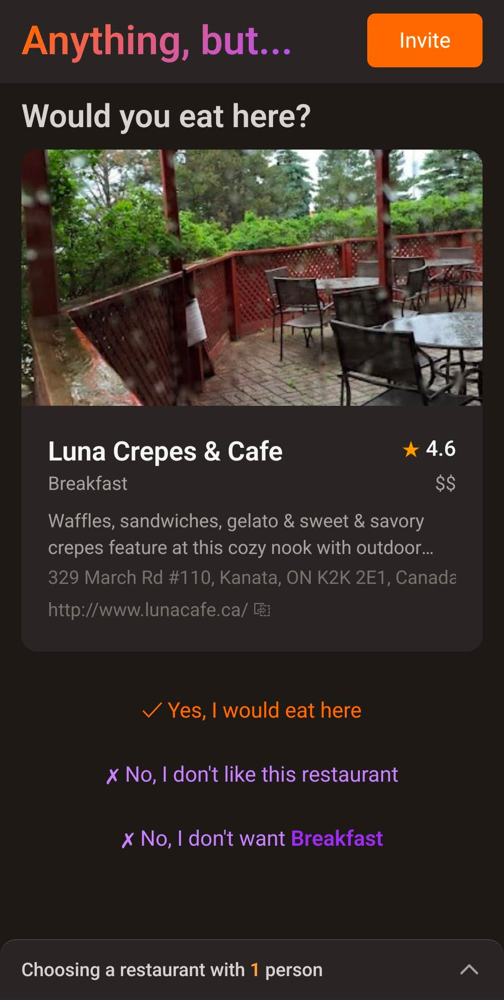

# Anything, but…

> Deciding where to eat is hard because everyone is picky. So instead of asking the group _where they want to go_, this app asks _where they **don't**_ — knocking out options in real time until a single restaurant is left standing.

**https://www.anythingbut.app/**



---

## The problem

Group restaurant decisions stall on "anywhere is fine" until someone vetoes the
one place that gets suggested. **Anything, but…** flips the question. Everyone in
the group votes options _down_ — by specific restaurant or by entire cuisine — and
the choices narrow collaboratively and in real time until one remains. No host
breaking ties, no endless thread.

## Features

- **Real-time collaboration** — every guest's veto syncs instantly across all
  devices in the group; no refresh, no polling.
- **Veto by restaurant or cuisine** — knock out a single place or rule out "no
  sushi tonight" in one tap.
- **Location-aware search** — autocomplete plus one-tap "use my current location"
  via the browser's Geolocation API.
- **Adjustable search radius** with a remembered unit preference (km/mi).
- **Frictionless invites** — share a group with a link or a scannable QR code.
- **Fast, cached restaurant photos** — Google Places photos are proxied and cached
  server-side to cut latency and redundant API calls.
- **Self-cleaning** — a daily cron job prunes groups older than 24 hours.

## Tech stack

| Layer                 | Choice                                            | Why                                                                                                                                                                                     |
| --------------------- | ------------------------------------------------- | --------------------------------------------------------------------------------------------------------------------------------------------------------------------------------------- |
| Framework             | **Next.js 16** (App Router) + **React 19**        | One codebase for the UI and the API routes that proxy Google Places.                                                                                                                    |
| Language              | **TypeScript** (strict)                           | Type-safe end to end, including the database schema.                                                                                                                                    |
| Real-time data        | **InstantDB**                                     | The core bet. Restaurant vetoes need to fan out to every guest instantly; InstantDB gives optimistic, subscription-based sync and a typed schema without standing up a websocket layer. |
| Styling               | **Tailwind CSS 4** + **class-variance-authority** | A small, typed component variant system (see `src/components/Button.tsx`).                                                                                                              |
| Accessible primitives | **Headless UI**                                   | Combobox / Dialog with keyboard & ARIA handling built in.                                                                                                                               |
| External data         | **Google Places API (New)**                       | Autocomplete, geocoding, restaurant details, and photos.                                                                                                                                |
| Testing               | **Jest** + **React Testing Library**              | Unit tests for pure logic and component behavior.                                                                                                                                       |
| Hosting               | **Vercel**                                        | Native Next.js hosting plus scheduled cron for cleanup.                                                                                                                                 |

## Architecture

```
Browser (React 19)
  │  ├─ InstantDB SDK  ──────────────►  InstantDB  (real-time groups, votes, presence)
  │  └─ fetch /api/*
  │
Next.js API routes (server)
  ├─ /api/places/*            ──►  Google Places API  (autocomplete, geocode, details)
  ├─ /api/places/photo        ──►  Google Places Photos  (+ in-memory LRU cache)
  ├─ /api/groups/[id]/prefetch──►  warms the restaurant list for a group
  └─ /api/cron/cleanup            (Vercel cron, daily — deletes groups > 24h old)
```

Votes and presence flow over InstantDB so collaboration is instant; anything that
needs a secret (the Google API key, the Instant admin token) stays behind a Next.js
API route. The InstantDB schema and permissions live in `src/instant.schema.ts` and
`src/instant.perms.ts`.

## Getting started

**Prerequisites:** Node 22 (see `.node-version`), plus a Google Places API key and an
InstantDB app.

```bash
# 1. Install dependencies
npm install

# 2. Configure environment
cp .env.example .env.local
# then fill in the values — see .env.example for where to get each one:
#   GOOGLE_PLACES_API_KEY        (Google Cloud Console, "Places API (New)" enabled)
#   NEXT_PUBLIC_INSTANT_APP_ID   (instantdb.com)
#   INSTANT_APP_ADMIN_TOKEN      (instantdb.com)
#   CRON_SECRET                  (any random string; protects the cleanup route)

# 3. Run the dev server
npm run dev
```

Open [http://localhost:3000](http://localhost:3000).

## Scripts

| Command                 | Description                                 |
| ----------------------- | ------------------------------------------- |
| `npm run dev`           | Start the dev server.                       |
| `npm run build`         | Production build.                           |
| `npm start`             | Serve the production build.                 |
| `npm run lint`          | ESLint (also runs on pre-commit via Husky). |
| `npm run typecheck`     | Type-check with `tsc --noEmit`.             |
| `npm test`              | Run the Jest test suite.                    |
| `npm run test:coverage` | Run tests with a coverage report.           |

## License

[MIT](LICENSE)
